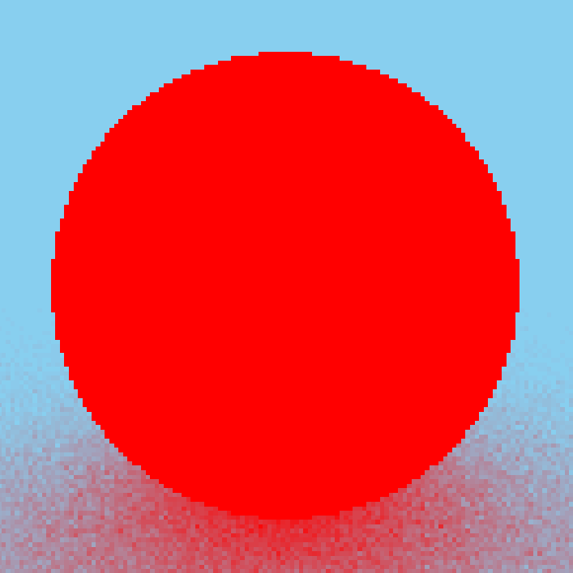
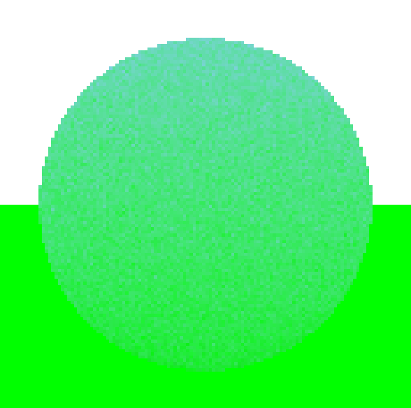
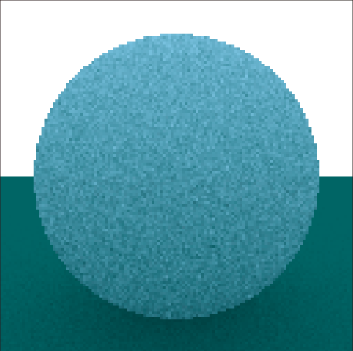
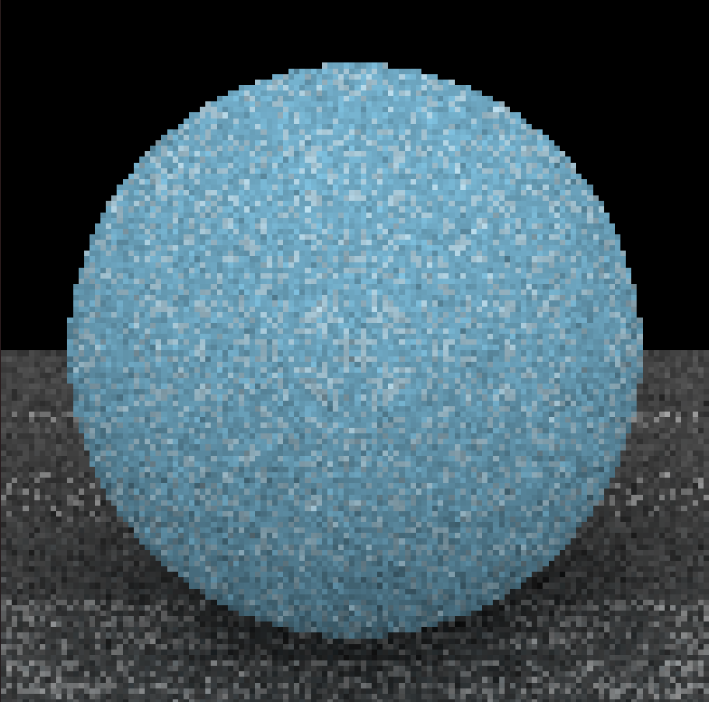
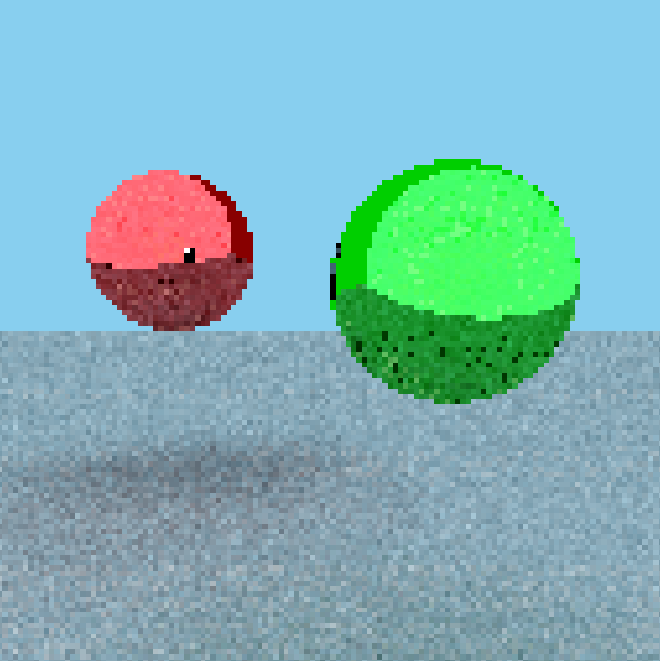
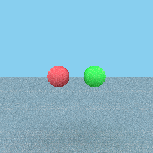
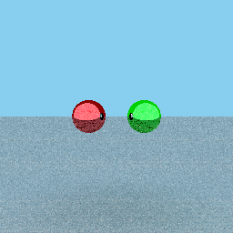
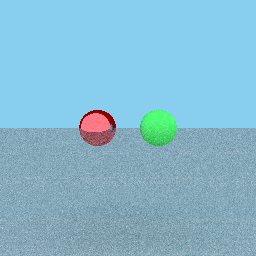
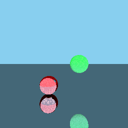
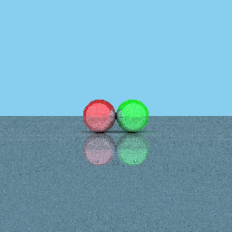

# RayTracing

This is a ground up raytracing photo generator based on [this video](https://www.youtube.com/watch?v=Qz0KTGYJtUk) by [Sebastian Lague](https://www.youtube.com/@SebastianLague).

To run the script, run testing.py, and there are plenty of parameters to change to orient objects, set their colors, and much more.

My biggest point of pride for this impelementation is that I was able to use a wide variety of techniques such as:
- Forward kinematics to define points relative to the camera
- Gradient descent and inverse kinematics to orient the camera in computer space
- Plenty of object creation, inheritance, and specification for different purposes
- Mathematical manipulation of vectors to create approximations for bouncing light

The algorithm runs even small images slowly since the GPU is heavily underutilized (no amount of threading or parallel processing), and the first changes I would make to the algorithm would be to alleviate this.

The images produced are all very grainy, too, a side effect of not having a lot of rays bounced around the environment, which would be greatly aided by anything that would speed up the algorithm.

Some additional features that, due to time constraints I was not able to integrate:
- Multiple rays at different angles for each pixel of the screen
- Additional object shapes beyond spheres and planes
- More accurate color-mixing algorithms
- A more interactive way to initialize the camera and objects instead of punching parameters into the code

Python is not a very choice language for this project, and it would greatly benefit from being in a language like C++ or Java, but we had been using Python for the class I had originally made this program for.

### Some choice results from my algorithm:

Test Images:

Two orbs with only diffuse bouncing:

Two orbs with only specular bouncing:

Two orbs, one that is reflective and one that isn't:

Two orbs, one reflective, on a mirror plane:

Three mirrors all touching:

